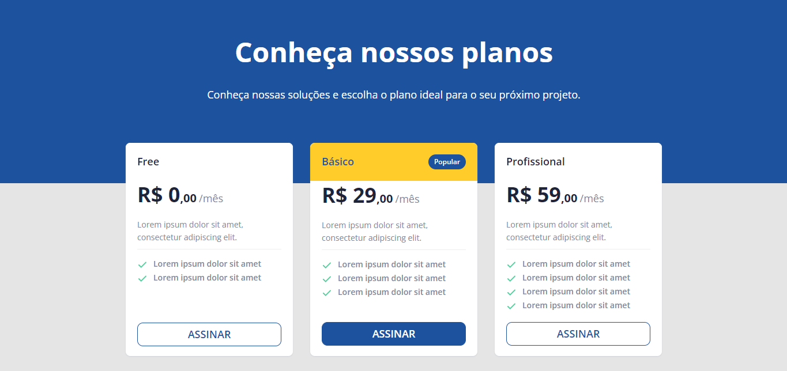

<h1 align="center"> Pricing Table </h1>

  <a href="#-tecnologias">Tecnologias</a>&nbsp;&nbsp;&nbsp;|&nbsp;&nbsp;&nbsp;
  <a href="#-projeto">Projeto</a>&nbsp;&nbsp;&nbsp;|&nbsp;&nbsp;&nbsp;
  <a href="#-layout">Layout</a>

 

  

## 🚀 Tecnologias

Esse projeto foi desenvolvido com as seguintes tecnologias:

- HTML e CSS
- Git e Github

## 💻 Projeto

O projeto consiste em uma página com uma tabela com opções de preços/planos do produto/serviço oferecido.

## 🔖 Layout

Você pode visualizar o layout do projeto através [DESSE LINK](<https://www.figma.com/file/oX2boWtDogWRP68PH6cvLl/DD-%2F-Pricing-Table-(Copy)?node-id=3%3A2&t=Hz74cT6587jowlSS-0>). É necessário ter conta no [Figma](https://figma.com) para acessá-lo.

---

Feito com ♥ by Milenna Palácio.
